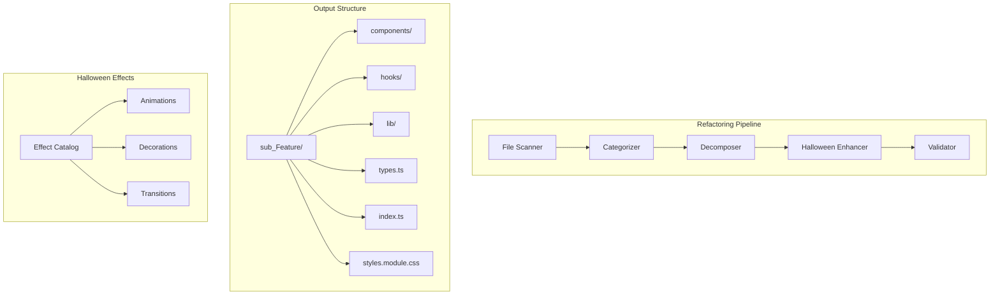

# Design Document: Halloween-Themed Refactoring

## Overview

This design outlines the systematic refactoring of 53 large files (>200 lines) in the Hyper project, following the established `sub_*` modular pattern. Each refactored component receives a unique Halloween visual enhancement to create an immersive theme experience beyond color switching.

### Target Files Summary

| Category | Count | Largest Files |
|----------|-------|---------------|
| CSS | 1 | globals.css (1,417 lines) |
| Services | 6 | marketplace.ts (907), story.ts (799), sync.ts (377) |
| Components | 25 | PromptPreview.tsx (554), StoryGraph.tsx (537), StoryNode.tsx (532) |
| Hooks | 8 | useOfflineStory.ts (526), useStoryGraphData.tsx (366) |
| Types | 3 | index.ts (650), nodes.ts (412), stackTemplates.ts (716) |
| Lib/Utils | 10 | high-contrast-palette.ts (491), compiler.ts (269) |

## Architecture



## Components and Interfaces

### File Scanner Module

```typescript
interface FileInfo {
  path: string;
  lineCount: number;
  category: FileCategory;
  priority: number;
}

type FileCategory = 
  | 'component' 
  | 'service' 
  | 'hook' 
  | 'type' 
  | 'style' 
  | 'util';

interface ScanResult {
  files: FileInfo[];
  totalLines: number;
  byCategory: Record<FileCategory, FileInfo[]>;
}

function scanDirectory(rootPath: string): Promise<ScanResult>;
function categorizeFile(filePath: string): FileCategory;
function prioritizeFiles(files: FileInfo[]): FileInfo[];
```

### Decomposition Module

```typescript
interface DecompositionPlan {
  sourceFile: string;
  targetFolder: string;
  extractedModules: ExtractedModule[];
}

interface ExtractedModule {
  name: string;
  type: 'component' | 'hook' | 'util' | 'type';
  targetPath: string;
  exports: string[];
}

interface BarrelExport {
  modulePath: string;
  namedExports: string[];
  defaultExport?: string;
}

function createDecompositionPlan(file: FileInfo): DecompositionPlan;
function generateBarrelFile(modules: ExtractedModule[]): string;
```

### Halloween Effect System

```typescript
interface HalloweenEffect {
  id: string;
  name: string;
  cssClass: string;
  description: string;
  applicableTo: ComponentType[];
  cssContent: string;
  reducedMotionFallback: string;
}

type ComponentType = 
  | 'card' 
  | 'button' 
  | 'input' 
  | 'modal' 
  | 'sidebar' 
  | 'graph' 
  | 'canvas';

interface EffectCatalog {
  effects: HalloweenEffect[];
  getEffectForComponent(componentType: ComponentType): HalloweenEffect;
  generateCSS(): string;
}
```

## Data Models

### Refactoring Target Registry

```typescript
interface RefactoringTarget {
  id: string;
  originalPath: string;
  lineCount: number;
  category: FileCategory;
  status: 'pending' | 'in-progress' | 'completed';
  outputPaths: string[];
  halloweenEffect?: string;
}

interface RefactoringSession {
  targets: RefactoringTarget[];
  startedAt: Date;
  completedAt?: Date;
  stats: {
    filesProcessed: number;
    linesReduced: number;
    modulesCreated: number;
    effectsApplied: number;
  };
}
```

### Halloween Effect Definitions

```typescript
const HALLOWEEN_EFFECTS: HalloweenEffect[] = [
  {
    id: 'ghost-float',
    name: 'Ghost Float',
    cssClass: 'halloween-ghost-float',
    description: 'Subtle floating animation with transparency pulse',
    applicableTo: ['card', 'modal'],
    cssContent: `
      .halloween .halloween-ghost-float {
        animation: ghostFloat 4s ease-in-out infinite;
      }
      @keyframes ghostFloat {
        0%, 100% { transform: translateY(0); opacity: 1; }
        50% { transform: translateY(-8px); opacity: 0.85; }
      }
    `,
    reducedMotionFallback: 'opacity: 0.95;'
  },
  {
    id: 'spider-web-corner',
    name: 'Spider Web Corner',
    cssClass: 'halloween-web-corner',
    description: 'Decorative web pattern in corner',
    applicableTo: ['card', 'sidebar'],
    cssContent: `/* SVG-based web decoration */`,
    reducedMotionFallback: ''
  },
  {
    id: 'candle-flicker',
    name: 'Candle Flicker',
    cssClass: 'halloween-candle',
    description: 'Flickering glow effect on borders',
    applicableTo: ['input', 'button'],
    cssContent: `/* Box-shadow animation */`,
    reducedMotionFallback: 'box-shadow: 0 0 10px hsl(270 70% 60% / 0.3);'
  },
  {
    id: 'bat-silhouette',
    name: 'Bat Silhouette',
    cssClass: 'halloween-bat',
    description: 'Small bat icon decoration',
    applicableTo: ['button', 'card'],
    cssContent: `/* Pseudo-element bat shape */`,
    reducedMotionFallback: ''
  },
  {
    id: 'cauldron-bubble',
    name: 'Cauldron Bubble',
    cssClass: 'halloween-bubble',
    description: 'Rising bubble animation',
    applicableTo: ['canvas', 'graph'],
    cssContent: `/* Bubble particles rising */`,
    reducedMotionFallback: ''
  },
  {
    id: 'pumpkin-glow',
    name: 'Pumpkin Glow',
    cssClass: 'halloween-pumpkin-glow',
    description: 'Orange inner glow pulsing',
    applicableTo: ['button', 'card'],
    cssContent: `/* Orange glow animation */`,
    reducedMotionFallback: 'box-shadow: inset 0 0 20px hsl(30 90% 50% / 0.2);'
  },
  {
    id: 'skeleton-rattle',
    name: 'Skeleton Rattle',
    cssClass: 'halloween-rattle',
    description: 'Subtle shake on hover',
    applicableTo: ['button', 'card'],
    cssContent: `/* Shake animation on hover */`,
    reducedMotionFallback: ''
  },
  {
    id: 'fog-overlay',
    name: 'Fog Overlay',
    cssClass: 'halloween-fog',
    description: 'Drifting fog effect',
    applicableTo: ['canvas', 'sidebar'],
    cssContent: `/* Gradient fog animation */`,
    reducedMotionFallback: 'background: linear-gradient(transparent, hsl(270 20% 10% / 0.1));'
  }
];
```

## Correctness Properties

*A property is a characteristic or behavior that should hold true across all valid executions of a system-essentially, a formal statement about what the system should do. Properties serve as the bridge between human-readable specifications and machine-verifiable correctness guarantees.*

### Property 1: File Scanner Completeness
*For any* directory containing .ts, .tsx, or .css files, the scanner SHALL return all files exceeding 200 lines with accurate line counts.
**Validates: Requirements 1.1**

### Property 2: File Categorization Consistency
*For any* file path, the categorizer SHALL return the same category when called multiple times, and the category SHALL match the file's location and naming convention.
**Validates: Requirements 1.2**

### Property 3: Priority Sorting Correctness
*For any* list of FileInfo objects, prioritizeFiles SHALL return them sorted by lineCount in descending order.
**Validates: Requirements 1.3**

### Property 4: Output File Size Constraint
*For any* decomposed module, the resulting file SHALL contain at most 200 lines of code.
**Validates: Requirements 2.3**

### Property 5: Barrel Export Completeness
*For any* created sub-module, the index.ts barrel file SHALL export all public symbols from the module's components.
**Validates: Requirements 2.5**

### Property 6: Export Preservation
*For any* refactored service or type file, all previously exported symbols SHALL remain accessible from the original import path.
**Validates: Requirements 3.3, 6.3**

### Property 7: CSS Halloween Compliance
*For any* Halloween effect CSS, the styles SHALL: (a) use animations or pseudo-elements, (b) include a prefers-reduced-motion media query, and (c) use colors from the 270° hue palette.
**Validates: Requirements 4.2, 4.3, 4.5**

### Property 8: Globals CSS Minimization
*For any* refactored globals.css, the file SHALL contain only :root variables, theme class definitions (.halloween), and base element selectors.
**Validates: Requirements 5.2**

### Property 9: CSS Module Co-location
*For any* extracted CSS module, the file SHALL exist in the same directory as its corresponding component file.
**Validates: Requirements 5.3**

### Property 10: Hook Composition Integrity
*For any* decomposed hook, the original hook file SHALL import and compose the extracted sub-hooks.
**Validates: Requirements 7.2**

### Property 11: Sub-hook Directory Structure
*For any* extracted sub-hook, the file SHALL be placed in a hooks/ subdirectory of the relevant feature folder.
**Validates: Requirements 7.3**

### Property 12: Effect Catalog Field Completeness
*For any* entry in the Halloween effect catalog, the entry SHALL include: effect name, CSS class, applicable components list, and CSS content.
**Validates: Requirements 8.2**

### Property 13: Utility Class Availability
*For any* documented Halloween effect pattern, a corresponding utility CSS class SHALL exist in the stylesheet.
**Validates: Requirements 8.3**

## Error Handling

### File System Errors
- **File not found**: Log warning, skip file, continue processing
- **Permission denied**: Log error, mark target as failed, continue
- **Disk full**: Halt processing, report partial progress

### Decomposition Errors
- **Circular dependencies**: Detect during analysis, report to user for manual resolution
- **Export conflicts**: Rename with suffix, document in migration notes
- **Type inference failures**: Preserve original types, add TODO comments

### CSS Parsing Errors
- **Invalid syntax**: Skip extraction, keep in globals.css
- **Missing variables**: Add fallback values, log warning

## Testing Strategy

### Unit Testing
- Test file categorization logic with various file paths
- Test sorting algorithm with edge cases (empty list, single item, duplicates)
- Test barrel file generation with various export combinations
- Test CSS parsing for Halloween compliance checks

### Property-Based Testing
Using `fast-check` for TypeScript property-based testing:

1. **Scanner Properties**: Generate random directory structures, verify all large files found
2. **Categorization Properties**: Generate random file paths, verify consistent categorization
3. **Sorting Properties**: Generate random FileInfo arrays, verify descending order
4. **Export Properties**: Generate random module structures, verify barrel completeness
5. **CSS Properties**: Generate random CSS content, verify Halloween compliance rules

### Integration Testing
- Verify refactored components render correctly
- Verify Halloween effects activate with theme toggle
- Verify no TypeScript compilation errors after refactoring
- Verify all existing tests pass after refactoring

### Visual Regression Testing
- Capture screenshots before/after refactoring
- Compare Halloween theme appearance
- Verify reduced-motion fallbacks work correctly
