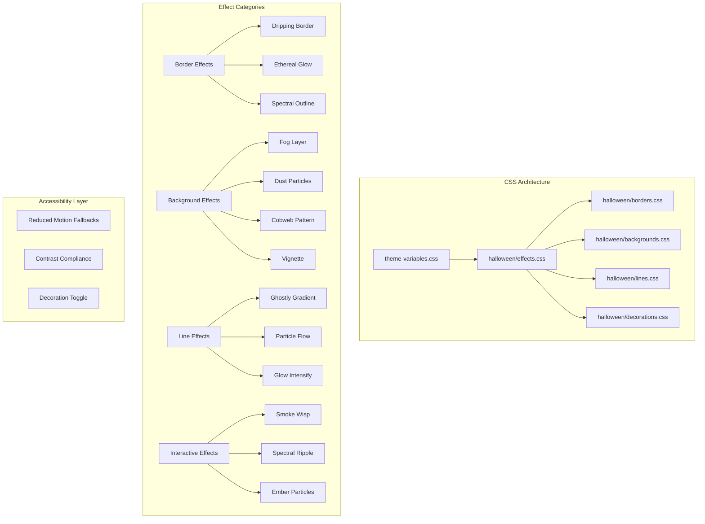

# Design Document: Halloween Theme Enrichment

## Overview

This design document outlines the enrichment of the Halloween theme in the Hyper editor, expanding beyond basic color theming to include distinctive visual styling for borders, connection lines, background decorations, and interactive states. The implementation uses CSS-only solutions for optimal performance, with all effects respecting accessibility preferences.

### Target Components

| Component | Decoration Type | Effect |
|-----------|----------------|--------|
| StoryGraph | Background, Lines | Fog layer, ghostly connection gradients |
| InfiniteCanvas | Background | Floating dust particles, vignette |
| StoryNode | Borders, Corners | Dripping borders, corner decorations, state-specific styles |
| OutlineSidebar | Dividers, Background | Branch-like dividers, cobweb overlay |
| PromptComposer | Container | Cauldron-inspired bubbling border |
| StoryCardEditor | Edges | Spell-book aged edges |
| CommandPalette | Glow | Crystal ball glow effect |
| ScriptQualityAssistant | Metrics | Potion-bottle aesthetic |

## Architecture



## Components and Interfaces

### Border Effect System

```typescript
interface BorderEffect {
  id: string;
  name: string;
  cssClass: string;
  applicableTo: ElementType[];
  pseudoElement: '::before' | '::after' | 'both';
  animationDuration?: string;
  reducedMotionFallback: string;
}

type ElementType = 
  | 'card' 
  | 'panel' 
  | 'input' 
  | 'node' 
  | 'sidebar'
  | 'modal';

const BORDER_EFFECTS: BorderEffect[] = [
  {
    id: 'dripping-border',
    name: 'Dripping Border',
    cssClass: 'halloween-drip-border',
    applicableTo: ['card', 'panel', 'node'],
    pseudoElement: '::after',
    animationDuration: '4s',
    reducedMotionFallback: 'border-bottom: 3px solid hsl(270 40% 35%);'
  },
  {
    id: 'ethereal-glow',
    name: 'Ethereal Glow',
    cssClass: 'halloween-ethereal-glow',
    applicableTo: ['panel', 'sidebar', 'modal'],
    pseudoElement: '::before',
    animationDuration: '3s',
    reducedMotionFallback: 'box-shadow: 0 0 20px hsl(270 70% 60% / 0.3);'
  },
  {
    id: 'spectral-outline',
    name: 'Spectral Outline',
    cssClass: 'halloween-spectral-outline',
    applicableTo: ['node', 'card'],
    pseudoElement: '::before',
    animationDuration: '2s',
    reducedMotionFallback: 'outline: 2px solid hsl(270 70% 60% / 0.5);'
  }
];
```

### Background Decoration System

```typescript
interface BackgroundDecoration {
  id: string;
  name: string;
  cssClass: string;
  layer: 'base' | 'overlay' | 'foreground';
  zIndex: number;
  pointerEvents: 'none' | 'auto';
  animationDuration?: string;
}

const BACKGROUND_DECORATIONS: BackgroundDecoration[] = [
  {
    id: 'fog-layer',
    name: 'Drifting Fog',
    cssClass: 'halloween-fog-layer',
    layer: 'overlay',
    zIndex: 1,
    pointerEvents: 'none',
    animationDuration: '20s'
  },
  {
    id: 'dust-particles',
    name: 'Floating Dust',
    cssClass: 'halloween-dust-particles',
    layer: 'overlay',
    zIndex: 2,
    pointerEvents: 'none',
    animationDuration: '30s'
  },
  {
    id: 'cobweb-pattern',
    name: 'Cobweb Overlay',
    cssClass: 'halloween-cobweb',
    layer: 'base',
    zIndex: 0,
    pointerEvents: 'none'
  },
  {
    id: 'vignette',
    name: 'Edge Vignette',
    cssClass: 'halloween-vignette',
    layer: 'foreground',
    zIndex: 3,
    pointerEvents: 'none'
  }
];
```

### Connection Line Styling

```typescript
interface LineStyle {
  id: string;
  name: string;
  gradient: string;
  strokeWidth: number;
  glowColor: string;
  hoverGlowIntensity: number;
  particleColor?: string;
}

const LINE_STYLES: Record<ChoiceType, LineStyle> = {
  default: {
    id: 'ghostly-default',
    name: 'Ghostly Path',
    gradient: 'linear-gradient(90deg, hsl(270 70% 60% / 0.8), hsl(270 70% 60% / 0.2))',
    strokeWidth: 2,
    glowColor: 'hsl(270 70% 60% / 0.4)',
    hoverGlowIntensity: 1.5,
    particleColor: 'hsl(270 70% 80%)'
  },
  positive: {
    id: 'spectral-positive',
    name: 'Spectral Green',
    gradient: 'linear-gradient(90deg, hsl(142 65% 50% / 0.8), hsl(142 65% 50% / 0.2))',
    strokeWidth: 2,
    glowColor: 'hsl(142 65% 50% / 0.4)',
    hoverGlowIntensity: 1.5,
    particleColor: 'hsl(142 65% 70%)'
  },
  negative: {
    id: 'blood-red',
    name: 'Blood Path',
    gradient: 'linear-gradient(90deg, hsl(0 70% 55% / 0.8), hsl(0 70% 55% / 0.2))',
    strokeWidth: 2,
    glowColor: 'hsl(0 70% 55% / 0.4)',
    hoverGlowIntensity: 1.5,
    particleColor: 'hsl(0 70% 70%)'
  },
  neutral: {
    id: 'misty-gray',
    name: 'Misty Path',
    gradient: 'linear-gradient(90deg, hsl(270 10% 60% / 0.8), hsl(270 10% 60% / 0.2))',
    strokeWidth: 2,
    glowColor: 'hsl(270 10% 60% / 0.3)',
    hoverGlowIntensity: 1.3,
    particleColor: 'hsl(270 10% 80%)'
  }
};
```

### Interactive Effect System

```typescript
interface InteractiveEffect {
  id: string;
  trigger: 'hover' | 'focus' | 'active' | 'drag';
  cssClass: string;
  duration: string;
  easing: string;
  reducedMotionBehavior: 'disable' | 'simplify';
}

const INTERACTIVE_EFFECTS: InteractiveEffect[] = [
  {
    id: 'smoke-wisp',
    trigger: 'hover',
    cssClass: 'halloween-smoke-wisp',
    duration: '0.6s',
    easing: 'ease-out',
    reducedMotionBehavior: 'disable'
  },
  {
    id: 'spectral-ripple',
    trigger: 'active',
    cssClass: 'halloween-spectral-ripple',
    duration: '0.4s',
    easing: 'ease-out',
    reducedMotionBehavior: 'disable'
  },
  {
    id: 'ember-particles',
    trigger: 'focus',
    cssClass: 'halloween-ember-focus',
    duration: '2s',
    easing: 'linear',
    reducedMotionBehavior: 'simplify'
  },
  {
    id: 'ghost-trail',
    trigger: 'drag',
    cssClass: 'halloween-ghost-trail',
    duration: '0.3s',
    easing: 'ease-out',
    reducedMotionBehavior: 'disable'
  }
];
```

## Data Models

### Decoration Configuration

```typescript
interface HalloweenDecorationConfig {
  enabled: boolean;
  borderEffects: boolean;
  backgroundDecorations: boolean;
  lineEffects: boolean;
  interactiveEffects: boolean;
  particleIntensity: 'low' | 'medium' | 'high';
}

const DEFAULT_CONFIG: HalloweenDecorationConfig = {
  enabled: true,
  borderEffects: true,
  backgroundDecorations: true,
  lineEffects: true,
  interactiveEffects: true,
  particleIntensity: 'medium'
};
```

### Component Decoration Mapping

```typescript
interface ComponentDecoration {
  component: string;
  borderEffect?: string;
  backgroundDecoration?: string;
  customStyles: Record<string, string>;
}

const COMPONENT_DECORATIONS: ComponentDecoration[] = [
  {
    component: 'OutlineSidebar',
    borderEffect: 'ethereal-glow',
    backgroundDecoration: 'cobweb-pattern',
    customStyles: {
      divider: 'halloween-branch-divider',
      header: 'halloween-tree-header'
    }
  },
  {
    component: 'PromptComposer',
    borderEffect: 'dripping-border',
    customStyles: {
      container: 'halloween-cauldron-container',
      border: 'halloween-bubbling-border'
    }
  },
  {
    component: 'StoryCardEditor',
    customStyles: {
      container: 'halloween-spellbook-page',
      edges: 'halloween-aged-edges'
    }
  },
  {
    component: 'CommandPalette',
    customStyles: {
      backdrop: 'halloween-crystal-glow',
      container: 'halloween-orb-container'
    }
  },
  {
    component: 'ScriptQualityAssistant',
    customStyles: {
      metrics: 'halloween-potion-metrics',
      score: 'halloween-potion-bottle'
    }
  },
  {
    component: 'StoryNode',
    borderEffect: 'spectral-outline',
    customStyles: {
      corners: 'halloween-corner-decoration',
      deadEnd: 'halloween-tombstone-border',
      start: 'halloween-portal-border',
      hover: 'halloween-crack-pattern'
    }
  }
];
```

## Correctness Properties

*A property is a characteristic or behavior that should hold true across all valid executions of a system-essentially, a formal statement about what the system should do. Properties serve as the bridge between human-readable specifications and machine-verifiable correctness guarantees.*

### Property 1: Border Effects Application
*For any* element with a Halloween border effect class (card, panel, input, node), when the Halloween theme is active, the element SHALL have the appropriate border decoration styles applied including pseudo-element content, box-shadow, or border-image properties.
**Validates: Requirements 1.1, 1.2, 1.3**

### Property 2: Reduced Motion Compliance
*For any* animated Halloween decoration, when prefers-reduced-motion is enabled, the animation SHALL be disabled and replaced with a static fallback style that maintains visual consistency without motion.
**Validates: Requirements 1.5, 7.1**

### Property 3: Connection Line Styling
*For any* connection line in the StoryGraph or InfiniteCanvas, when the Halloween theme is active, the line SHALL display the appropriate gradient color based on choice type, and hover states SHALL intensify the glow effect.
**Validates: Requirements 2.1, 2.3, 2.4**

### Property 4: Divider Decoration
*For any* horizontal or vertical divider element, when the Halloween theme is active, the divider SHALL display the appropriate edge effect (torn/jagged for horizontal, dripping for vertical) using clip-path or pseudo-elements.
**Validates: Requirements 4.1, 4.2**

### Property 5: Node State Decorations
*For any* story node in any state (default, selected, hover, dead-end, start), when the Halloween theme is active, the node SHALL display the appropriate decoration including corner elements, outline styles, and state-specific border treatments.
**Validates: Requirements 5.1, 5.2, 5.3, 5.4, 5.5**

### Property 6: Interactive Effect Feedback
*For any* interactive element (button, input, draggable node), when the Halloween theme is active and the element receives interaction (hover, focus, click, drag), the element SHALL display the appropriate feedback effect without blocking pointer events on the element's clickable area.
**Validates: Requirements 6.1, 6.3, 6.5**

### Property 7: CSS Performance Compliance
*For any* animated Halloween decoration overlay, the CSS SHALL use GPU-accelerated properties (transform, opacity) for animations and fixed/absolute positioning to avoid layout thrashing.
**Validates: Requirements 7.3, 7.4**

### Property 8: Text Contrast Compliance
*For any* text element rendered over Halloween decorations, the text color and background combination SHALL maintain a minimum contrast ratio of 4.5:1 for normal text and 3:1 for large text (WCAG AA).
**Validates: Requirements 7.2**

## Error Handling

### CSS Loading Errors
- **Missing CSS file**: Fall back to base Halloween theme colors without decorations
- **Invalid CSS syntax**: Browser ignores invalid rules, base styles remain functional
- **Animation performance issues**: Detect via performance API, reduce particle count

### Accessibility Fallbacks
- **Reduced motion not detected**: Default to full animations, user can toggle manually
- **High contrast mode**: Disable decorative overlays that reduce contrast
- **Screen reader conflicts**: Ensure all decorative elements have `aria-hidden="true"`

### Browser Compatibility
- **CSS features not supported**: Use `@supports` queries for progressive enhancement
- **Pseudo-element limits**: Fall back to single pseudo-element if both needed
- **Animation performance**: Provide CSS variable to reduce animation complexity

## Testing Strategy

### Unit Testing
- Test CSS class application logic for each component
- Test decoration configuration parsing and validation
- Test reduced motion detection and fallback application
- Test contrast ratio calculation utilities

### Property-Based Testing
Using `fast-check` for TypeScript property-based testing:

1. **Border Effects Property**: Generate random element types, verify correct border styles applied
2. **Reduced Motion Property**: Generate random animated elements, verify animations disabled when preference set
3. **Line Styling Property**: Generate random choice types, verify correct gradient colors applied
4. **Divider Property**: Generate random divider orientations, verify correct edge effects
5. **Node Decoration Property**: Generate random node states, verify correct decorations applied
6. **Interactive Effects Property**: Generate random interaction types, verify pointer-events preserved
7. **Performance Property**: Generate random overlay elements, verify GPU-accelerated properties used
8. **Contrast Property**: Generate random text/background combinations, verify WCAG AA compliance

### Visual Regression Testing
- Capture screenshots of each component with Halloween theme active
- Compare before/after decoration implementation
- Verify reduced motion fallbacks render correctly
- Test across different viewport sizes

### Accessibility Testing
- Automated contrast ratio checking with axe-core
- Screen reader testing for decorative element hiding
- Keyboard navigation testing with decorations active
- Motion sensitivity testing with prefers-reduced-motion

